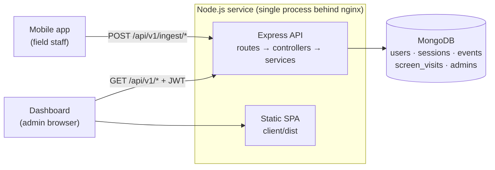

# Mahindra App Analytics

A self-hosted mobile product-analytics platform — a Mixpanel/Firebase Analytics-style stack built for the Mahindra farm-equipment field app.

The mobile app posts sessions, screen views and events to an Express ingestion API; a React dashboard turns them into KPIs, funnels, retention curves, role and dealership breakdowns, and feature-adoption reports.

<p>
  
  
  
  
  
</p>

---

## Table of contents

- [Capabilities](#capabilities)
- [Architecture](#architecture)
- [Tech stack](#tech-stack)
- [Repository layout](#repository-layout)
- [Getting started](#getting-started)
- [Configuration](#configuration)
- [API overview](#api-overview)
- [Data model](#data-model)
- [Data sourcing](#data-sourcing)
- [Operations](#operations)
- [Deployment](#deployment)
- [Documentation](#documentation)
- [License](#license)

---

## Capabilities

**Ingestion**
- Public, unauthenticated SDK endpoints for user identification, login tracking, session start/end, batched events (1–50 per request) and screen visits.
- Per-user rate limiting so an entire device fleet behind one NAT/proxy address does not share a single budget.
- Event-name normalisation at write time, which keeps high-cardinality API-call URLs from dominating storage.

**Dashboard**
- **Overview KPIs** — users, sessions, events, screen views, average session duration, with time-series graphs.
- **Real-time** — active users and live sessions, polled every 10–15 seconds.
- **Users** — searchable directory, per-user detail, activity timeline and session history; the whole dashboard can be scoped to a single user.
- **Engagement** — session, screen and event analytics with distributions, trends and top-N tables.
- **Retention & reports** — cohort retention curves, usage trends, engagement scores, and compiled daily/weekly/monthly reports.
- **Role analytics** — headcount and activity by the role the app reports, plus a frequent/occasional/low/no-login user classification and an Excel export.
- **Dealer & geography** — rollups by Salesforce dealership account and that account's billing state/city.
- **Feature usage** — adoption of the enquiry lifecycle, product guide, village visit, booking and delivery features, split by role group.

---

## Architecture



The backend is a strict four-layer stack — **routes → controllers → services → models**. Controllers stay thin (validate, delegate, format); every aggregation pipeline and business rule lives in a service; models own schema and indexes. All responses share one envelope, and all errors are raised as a typed `ApiError`.

In production a single Node process both serves the API under `/api/v1` and hosts the compiled React bundle from `client/dist`, with an SPA fallback for client-side routes. nginx terminates TLS in front of it.

---

## Tech stack

| Layer | Technology |
|---|---|
| Runtime | Node.js, Express 5 |
| Database | MongoDB with Mongoose 9 |
| Auth | JWT bearer tokens, bcrypt-hashed admin credentials |
| Hardening | helmet, CORS, compression, express-rate-limit, express-validator |
| Reporting | ExcelJS (streamed workbook export), Winston + Morgan logging |
| Frontend | React 19, Vite 8, React Router 7 |
| UI | shadcn/ui on Tailwind CSS v4 and Base UI primitives, Phosphor icons |
| Data & charts | TanStack Query, Recharts, Axios, Day.js |

---

## Repository layout

```
.
├── server/                 # Express API + ingestion
│   ├── config/             # Environment configuration
│   ├── controllers/        # Thin HTTP handlers
│   ├── data/               # Role & dealership taxonomies, shared generators
│   ├── database/           # Connection + sample-data seeder
│   ├── middleware/         # Auth, errors, response envelope, rate limits
│   ├── models/             # Mongoose schemas and indexes
│   ├── routes/             # Route mounts (public vs. authenticated)
│   ├── scripts/            # Storage diagnostics & one-off migrations
│   ├── services/           # Business logic and aggregation pipelines
│   ├── utils/              # Errors, pagination, date ranges, JWT, logging
│   └── validators/         # express-validator rule sets
├── client/                 # React dashboard
│   └── src/
│       ├── api/            # Axios instance + one module per API domain
│       ├── components/     # UI primitives, charts, tables, shared widgets
│       ├── context/        # Theme, global filters, auth
│       ├── hooks/          # TanStack Query wrappers, one per domain
│       ├── layouts/        # Shell, sidebar, header
│       └── pages/          # One directory per route
└── docs/                   # API reference, Postman collection, integration guide
```

---

## Getting started

### Prerequisites

- Node.js 20 or newer
- MongoDB (local instance or an Atlas cluster)
- pnpm for the server, npm for the client

### 1. Backend

```bash
cd server
pnpm install
cp .env.example .env          # then edit MONGO_URI and JWT_SECRET
pnpm dev                      # nodemon, hot reload
```

The API listens on `PORT` (default `5000`) and exposes an unauthenticated liveness check:

```bash
curl http://localhost:5000/api/v1/health
```

On first boot the service creates a single admin account from `ADMIN_USERNAME` / `ADMIN_PASSWORD`. Creation is idempotent, so changing those values later does not rotate the existing account — update the `admins` collection directly.

### 2. Sample data (optional)

```bash
pnpm seed
```

> **Warning:** the seeder **deletes** all users, sessions, events, screen visits and analytics summaries before regenerating 30 days of synthetic traffic. Never run it against production.

### 3. Frontend

```bash
cd client
npm install
npm run dev                   # http://localhost:5173
```

Point the dashboard at your API by setting `VITE_API_URL` in `client/.env`:

```env
VITE_API_URL=http://localhost:5000/api/v1
```

Sign in at `/login` with the seeded admin credentials. Every route except the login page requires an authenticated session.

### Available commands

| Location | Command | Description |
|---|---|---|
| `server/` | `pnpm dev` | Start with nodemon hot-reload |
| `server/` | `pnpm start` | Start in production mode |
| `server/` | `pnpm seed` | Reset the database and load sample data |
| `client/` | `npm run dev` | Vite dev server |
| `client/` | `npm run build` | Production build to `client/dist/` |
| `client/` | `npm run preview` | Serve the production build locally |
| `client/` | `npm run lint` | ESLint |

No automated test suite is configured in either workspace.

---

## Configuration

All server variables have defaults in `config/env.js`; only `MONGO_URI` and `JWT_SECRET` really need setting.

| Variable | Default | Description |
|---|---|---|
| `PORT` | `5000` | HTTP port |
| `MONGO_URI` | `mongodb://localhost:27017/appanalytics` | MongoDB connection string |
| `NODE_ENV` | `development` | Switches request logging format |
| `CORS_ORIGIN` | `http://localhost:5173` | Parsed but not currently applied — `index.js` allows all origins |
| `JWT_SECRET` | insecure placeholder | **Must be overridden.** Signing key for admin tokens |
| `JWT_EXPIRES_IN` | `7d` | Token lifetime |
| `RATE_LIMIT_WINDOW_MS` | `60000` | Ingestion rate-limit window |
| `RATE_LIMIT_MAX` | `200` | Ingestion requests per window, per user |
| `ADMIN_USERNAME` | `admin` | Seeded on first boot |
| `ADMIN_PASSWORD` | `1234` | Seeded on first boot — change before deploying |

Client variables (`client/.env`, `client/.env.production`):

| Variable | Description |
|---|---|
| `VITE_API_URL` | API root including `/api/v1`. Use a relative `/api/v1` in production, where the API and SPA share an origin |

---

## API overview

**Base URL:** `/api/v1` · **Content type:** `application/json`

Every response uses the same envelope:

```json
{ "success": true, "data": {}, "meta": { "page": 1, "limit": 20, "total": 500, "totalPages": 25 } }
```

```json
{ "success": false, "error": { "code": "NOT_FOUND", "message": "Resource not found" } }
```

`/ingest/*` and `/auth/login` are public; every other route requires an `Authorization: Bearer <token>` header obtained from `POST /auth/login`. Ingestion is limited to 200 requests per minute per user, dashboard reads to 300 per minute. List endpoints accept `page` and `limit` (max 100); analytics endpoints accept `startDate` / `endDate` and an optional `userId` and `platform` scope.

| Prefix | Purpose |
|---|---|
| `/health` | Liveness check |
| `/auth/*` | `login`, `me`, `logout` |
| `/ingest/*` | `identify`, `login`, `session/start`, `session/end`, `events`, `screen` |
| `/dashboard/*` | Summary KPIs, graphs, real-time, devices, app versions, funnel, retention curve, performance, geography, role and dealer analytics, user classification, feature usage, Excel export |
| `/users/*` | Directory, detail, timeline, sessions, top/active users, demographics |
| `/sessions/*` | List, detail, stats, hourly and trend series |
| `/events/*` | List, distribution, top events, stats, trend, summary |
| `/screens/*` | Screen analytics, top screens, per-screen trend |
| `/analytics/*` | Retention cohorts, usage trend, engagement |
| `/reports/*` | Daily, weekly and monthly compiled reports |

The full request/response reference, including payload examples for every ingestion endpoint, lives in [`docs/postman/API_DOCUMENTATION.md`](docs/postman/API_DOCUMENTATION.md), with an importable [Postman collection](docs/postman/AppAnalytics.postman_collection.json) alongside it.

---

## Data model

| Collection | Contents |
|---|---|
| `users` | One document per mobile user: profile, lifetime totals, reported role, denormalised dealership details, and login activity |
| `sessions` | One document per app session: start/end, duration, device, screens visited |
| `events` | Every analytics event; the high-volume collection, indexed by user, session, type, screen and name against time |
| `screen_visits` | Screen-level records denormalised from events for fast screen analytics |
| `analytics_summaries` | Pre-aggregated daily/weekly/monthly snapshots (populated by the seeder) |
| `admins` | Dashboard credentials |

Two organisational dimensions are modelled, and both come straight from the app:

- **Role** — a closed list mirroring the app's own role ladder. Unknown roles are rejected at ingestion, so a new role must be added to the taxonomy before the app ships it.
- **Dealership** — the Salesforce account a user belongs to, plus that account's billing address. This geography locates the *dealership*, not the user; reports read as "users attached to a dealership billed in <state>". Dealer names and places are open sets, normalised on write rather than validated against an enum.

Users are classified by distinct login days: **frequent** (more than 20), **occasional** (5–20), **low** (1–4) and **no login** (0).

---

## Data sourcing

Most of the dashboard aggregates live MongoDB data. Two areas are explicitly not live, and it is worth knowing which is which before trusting or extending a number:

| Surface | Source |
|---|---|
| Overview, users, sessions, screens, events, retention, reports, role analytics, dealer & geography | Live aggregations |
| Feature usage | Live aggregation once the relevant feature events exist for a role group; a deterministic placeholder until then |
| Screen usage, module usage, workflow break | Placeholder data only — generated from a seeded hash with no database reads. These pages are **disabled** in the dashboard navigation; their endpoints still respond |

The placeholder generator is deterministic, so values stay stable across refreshes while still reacting to the active filters. `docs/APP_INTEGRATION_FEATURE_USAGE.md` tracks what the mobile app still needs to send for feature usage to become fully live.

---

## Operations

`server/scripts/` holds the operational tooling, written against a constrained (512 MB) database tier where cost is driven by logical data plus index size.

Read-only diagnostics:

```bash
node scripts/measure-storage.js             # what is consuming the storage budget
node scripts/diagnose-growth.js             # why the event collection is growing
node scripts/measure-retention-options.js   # reclaim available from each retention policy
node scripts/audit-client-requirements.js   # is a missing report a code gap or a data gap?
```

Mutating scripts are **dry-run by default** and require `--apply` to write. They work in bounded batches, and are safe to re-run and safe to interrupt:

```bash
node scripts/purge-api-call-events.js --days=14      # preview
node scripts/purge-api-call-events.js --days=14 --apply
```

Also available: `backfill-normalize-api-names.js`, `drop-redundant-indexes.js`, `rebuild-eventname-index.js` and `drop-geo-fields.js`. Keep the dry-run/`--apply` contract when adding new scripts.

---

## Deployment

1. Build the dashboard: `cd client && npm run build`.
2. Set `VITE_API_URL=/api/v1` in `client/.env.production` so the SPA calls its own origin.
3. Start the API in production mode (`pnpm start`) with `NODE_ENV=production`, a real `JWT_SECRET` and a production `MONGO_URI`.
4. Put nginx in front to terminate TLS and proxy to the Node process. The app trusts exactly one proxy hop, which keeps client-supplied forwarding headers from spoofing the address used for rate limiting and logs.

Express serves `client/dist` directly, so a frontend change only reaches production after a rebuild — no separate static host is required.

---

## Documentation

| Document | Audience |
|---|---|
| [`docs/postman/API_DOCUMENTATION.md`](docs/postman/API_DOCUMENTATION.md) | Full ingestion API reference with payload examples |
| [`docs/postman/AppAnalytics.postman_collection.json`](docs/postman/AppAnalytics.postman_collection.json) | Importable Postman collection and environment |
| [`docs/APP_INTEGRATION_FEATURE_USAGE.md`](docs/APP_INTEGRATION_FEATURE_USAGE.md) | Mobile-team integration guide for feature-usage tracking |
| [`CLAUDE.md`](CLAUDE.md) | Architecture and conventions reference for contributors |

These documents are maintained by hand — update them in the same change that alters an ingestion or dashboard endpoint.

---

## License

Licensed under the [Apache License 2.0](LICENSE).
